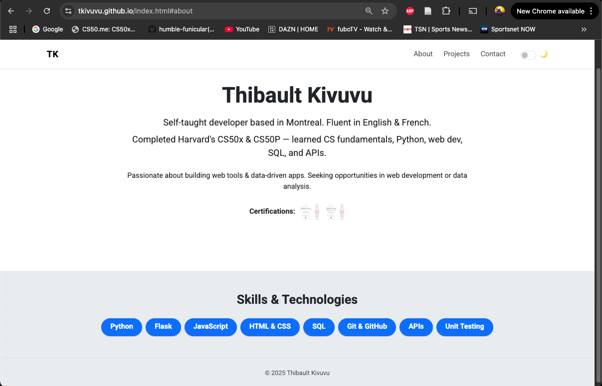
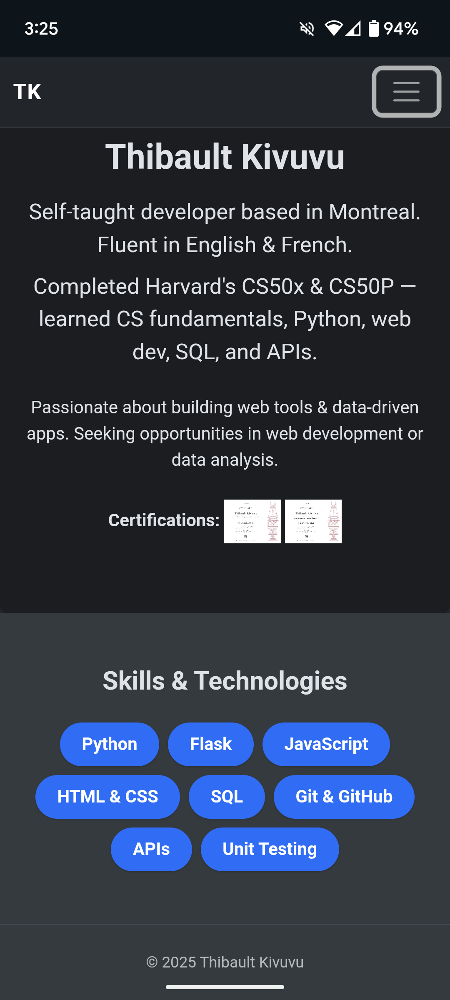

# Thibaut Kivuvu • Portfolio Website 🌐

My personal portfolio website showcasing my background, skills, and CS50-inspired projects.

**🔗 Live site:** [https://tkivuvu.github.io](https://tkivuvu.github.io)

Built using semantic HTML, Bootstrap 5, custom CSS, and vanilla JavaScript — fully responsive, accessible, and deployed via GitHub Pages.

---

## ✨ Features

* **Three-page layout**: Includes an About page (index), Projects showcase, and Contact form.
* **Dark/light mode toggle**: Switch themes with a click. State saved with localStorage.
* **Responsive design**: Looks great on mobile, tablet, and desktop screens.
* **Interactive project cards**: Hover effects, collapsible "More details" sections.
* **Contact form**: Formspree-powered, no backend needed.
* **Deployed on GitHub Pages**: No build tools required.

---

## 🛠️ Tech Stack

* **HTML5** – semantic, accessible markup
* **CSS3** – custom styles + Bootstrap 5.3
* **JavaScript** – for theme toggling
* **Formspree** – simple contact form backend
* **GitHub Pages** – for hosting

---

## 📁 File Structure

```
/
├── index.html            # About section, skills, certifications
├── projects.html         # Gallery of featured CS50 projects
├── contact.html          # Contact details + working form
├── styles.css            # Custom theme, animations, transitions
├── assets/               # GIFs, badge images, future screenshots
└── README.md
```

---

## 🖼️ Screenshots

| Desktop                                   | Mobile                                  |
| ----------------------------------------- | --------------------------------------- |
|  |  |

---

## 🚀 Run Locally

No build step needed — it's a fully static site.

```bash
git clone https://github.com/tkivuvu/tkivuvu.github.io
cd tkivuvu.github.io
open index.html  # or just double-click it
```

### Optional: Run with local server

```bash
# install lite-server or use VS Code Live Server
npm install -g serve
serve .
```

---

## 🎓 Highlighted Projects

From Harvard’s CS50x and CS50P courses:

* **NBA Stats Hub** – Full-stack Flask web app querying NBA APIs, caching data, and rendering charts.
* **F1 History CLI** – Python command-line tool pulling F1 data via Jolpica F1 API. Includes a full pytest test suite.
* **Finance** – Flask + SQLite app that simulates a stock trading platform.
* **Sports Homepage & Quiz** – Responsive static site with JavaScript-powered trivia.
* **Fiftyville SQL Mystery** – SQL-based crime-solving project using real database joins and queries.
* **Jar (OOP Demo)** – Simple Python class demonstrating encapsulation and object-oriented design.

Each one is featured on the [Projects page](https://tkivuvu.github.io/projects.html) with demo GIFs and GitHub links.

---

## 📬 Contact

Want to connect or collaborate?

* **Email**: [t.kivuvu@yahoo.com](mailto:t.kivuvu@yahoo.com)
* **GitHub**: [@tkivuvu](https://github.com/tkivuvu)
* **LinkedIn**: [Thibaut Kivuvu](https://www.linkedin.com/in/thibaut-kivuvu-aa5459375/)

Or use the contact form on [contact.html](https://tkivuvu.github.io/contact.html) — messages go directly to my inbox via Formspree.

---

## 🤝 Contributing

Suggestions for accessibility, mobile UX, or additional animations are welcome.

1. Fork this repo
2. Create a feature branch: `git checkout -b improve-style`
3. Commit your changes: `git commit -m "Improve card animations"`
4. Push and open a pull request

---

## 📄 License

MIT © 2025 Thibaut Kivuvu
This project is open source and free to use — see LICENSE file for full terms.

---

## 🙏 Acknowledgements

* [Harvard CS50x](https://cs50.harvard.edu/x) and [CS50P](https://cs50.harvard.edu/python)
* [Bootstrap](https://getbootstrap.com/) and [Formspree](https://formspree.io/)
* [Google Fonts](https://fonts.google.com/specimen/Roboto) – Roboto typeface
* GitHub for hosting via GitHub Pages

---

